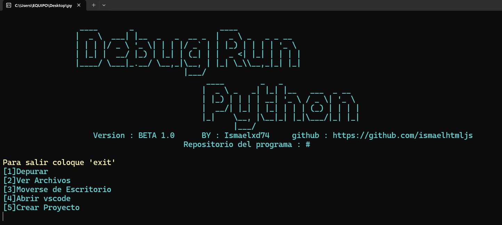

# Bug
es mejor que en la terminal inicien el programa `python Program(Recomendado).py` porque al intentar ejecutar el otro hecho en `c#` lo pasa como si fuera virus, aparte que al intentar iniciarlo sale error

# DEBUG RUN PYTHON
En este repositorio podras usar la herramienta `Debug run python` para depurar y crear proyectos en python

# Recomendación
Para iniciar el programa entre en su terminal y navege hasta la carpeta llamada `Debug run python` y ejecute el siguente codigo : `dotnet run`

# Imagenes del programa

